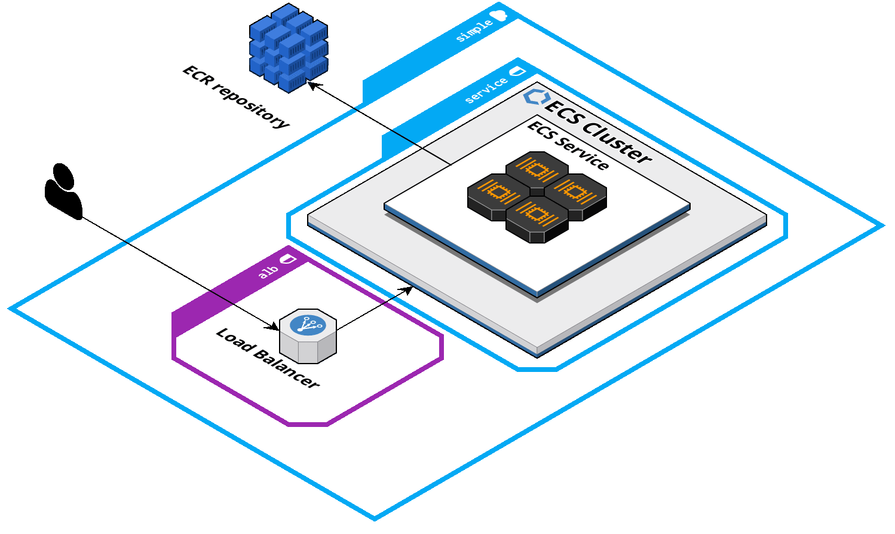

# container-factorial

Containerized Golang application running in ECS Fargate that calculates the factorial of a given number.

## Usage

Endpoint | HTTP Method | Example
--- | --- | ---
`/factorial/:n` | `GET` | `/factorial/7`

## Architecture diagram 

## Deployment

The application follows a rolling release method: pushing to `master` will trigger a deployment using Github Actions and Terraform Cloud.

### High-level pipeline overview

1. Install and setup Terraform
1. Validate Terraform code
1. Run Terraform plan and share output on pull request
1. Run Terraform apply when committing to `master`
1. Log in to Amazon ECR
1. Run Docker build, tag, and push image to Amazon ECR
